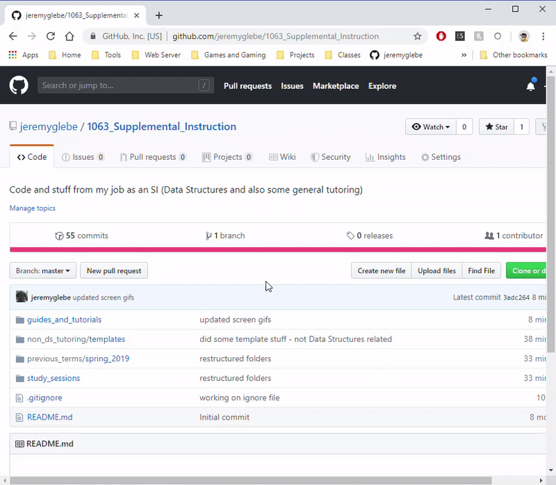
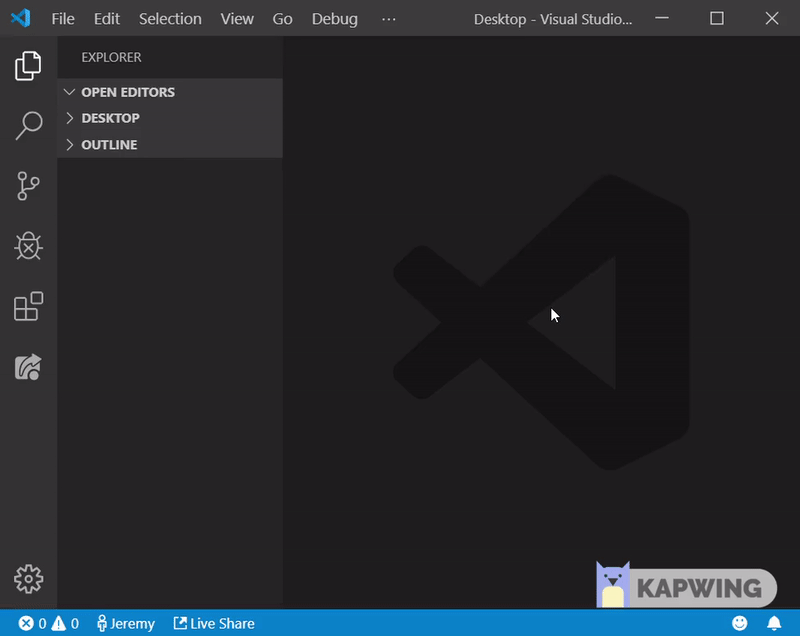
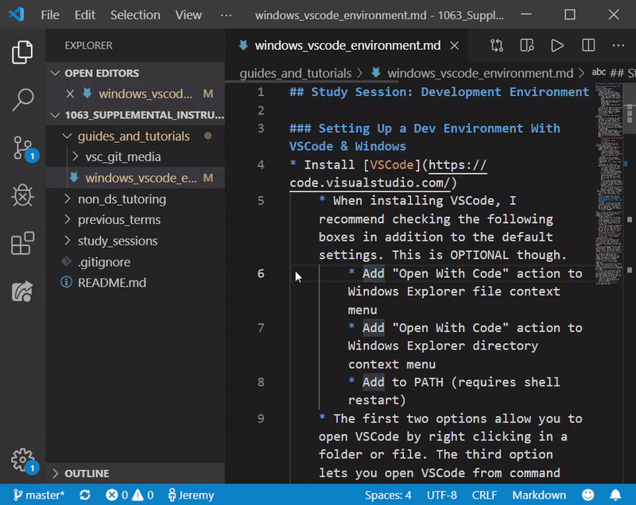
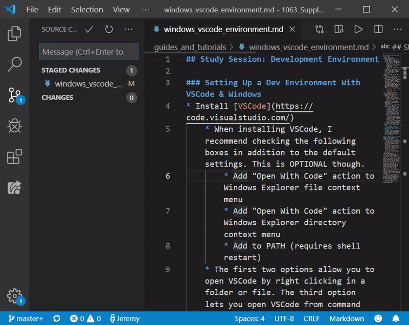
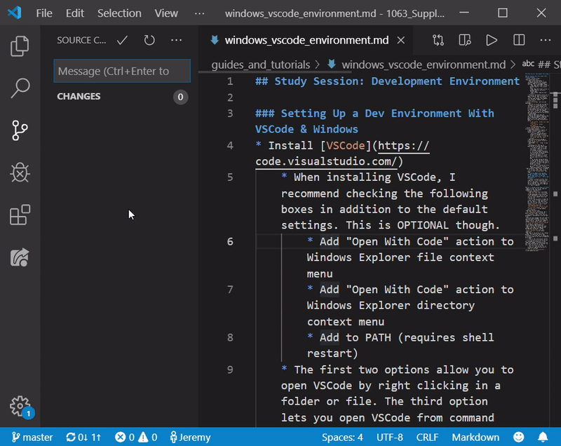

## Install [Git](https://git-scm.com/downloads)
Git is a useful tool for project management, version control, and
collaboration. Regardless of whether you intend to use websites like GitHub,
Git can still be a useful tool for your development environment. It also comes
with a Bash terminal which has many features not present in Windows Command
Line. Unless you are absolutely sure you don't want to use Git, and have an
alternative set up, you should follow these steps.
* Once Git is installed, we need to configure it to know who you are (Git logs who makes changes to a project). As far as I can tell, it is unavoidable that you will have to do this bit through the command line. Don't worry, just two commands and then everything else can be done through VSCode.
* Open Git Bash and type the following two commands. Replace John Doe's name and email (inside the quotes) with your name and email. Make sure to include the quotation marks!
    * `git config --global user.name "John Doe"`
    * `git config --global user.email "johndoe1955@hotmail.com"`

## How to Manage GitHub Repo with VSCode
This is an extra section for developers who want to use VSCode to manage their
code repository on GitHub. I assume that you 1) have a GitHub account and
2) have created and can navigate to your repository. Everything else should be
covered below.
* Make sure you ran the two required commands in the steps above
* Clone your repository
    * Copy the clone link from GitHub
    
    * Hit CTRL+SHIFT+P, search for and use the clone command. Paste your cloning link.
    * It will ask you where to make the clone, select a folder you wish to put the repo in. (The repo itself will be in a new folder, so if you choose `desktop`, it will create `desktop/your_repo_name`)
    
* Now open the new folder (`your_repo_name`) with VSCode. We'll work from this folder from now on.
* Click around, create files, work on assignments, and whatever else you want to do.
* Once you have changes that you need to save and send to GitHub, click on the "Source Control" tab and the "Stage All Changes" button (which looks like a '+')

* Now click the check mark that says "Commit" and type in an appropriate message describing your changes

* Now look at the bottom of your VSCode window. You should see two arrows forming a circle and next to them an up arrow and a down arrow (each accompanied by a number)
    * This is the "synchronize" button.
* Click the synchronize button and you will automatically push all of your committed changes to GitHub as well as pull down anything you're missing from your local version of the repo.
    * The first time you do this, a window will pop up asking you to sign in to GitHub.

